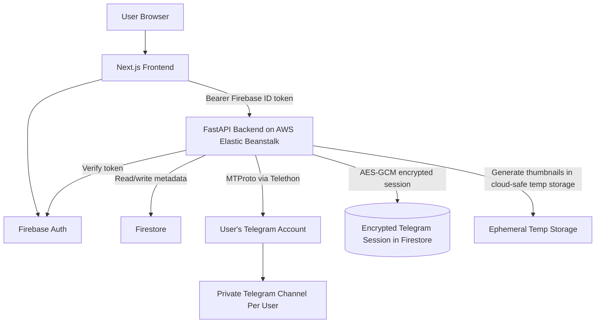

# PixlVault Architecture

## System Overview

## Core Boundaries

- Firebase Auth owns web identity.
- Telegram MTProto owns media storage.
- Firestore stores metadata only.
- Telegram sessions stay server-side and encrypted.
- Each user gets one isolated Telegram session and one private channel.

## Request Flow

1. User signs in with Firebase Auth.
2. Frontend sends Firebase ID token to the backend.
3. Backend verifies the token with Firebase Admin.
4. User starts Telegram linking with their phone number.
5. Backend asks Telegram for an OTP using Telethon.
6. User enters the OTP in the frontend.
7. Backend verifies OTP, encrypts the session, and stores it in Firestore.
8. Backend creates a private Telegram channel for that user.
9. All future uploads go to that user's private Telegram channel.
